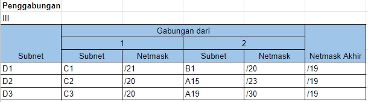

# Jarkom-Modul-4-A14-2023

## Pembagian subnet
Berikut ini adalah pembagian subnet kami, nilai netmask sendiri dihitung dengan menggunakan rumus berikut $32-ceil(\log{_2}(jumlah IP + 2))$   

## VLSM
Pada VLSM, setiap subnet akan dialokasikan sejumlah ip tertentu untuk digunakan keseluruhan subnet. Berikut ini adalah cara kami dalam membagikan IP dengan metode VLSM  
  
Sehingga pembagian IP yang ada adalah seperti berikut  
  

## CIDR
Pada CIDR, subnet-subnet akan digabung gabungkan hingga akhirnya akan didapatkan 1 subnet besar yang mencakup seluruh topologi  
  
  
  
  
  
  
  
  
Dengan penggabungan-penggabungan tersebut, berikut ini adalah ilustrasi tree yang ada  
  
Sehingga pembagian IP yang ada adalah seperti berikut  
  
