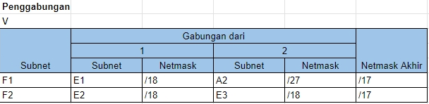

# Jarkom-Modul-4-A14-2023

## Pembagian subnet
Berikut ini adalah pembagian subnet kami, nilai netmask sendiri dihitung dengan menggunakan rumus berikut $32-ceil(\log{_2}(jumlah IP + 2))$   


## VLSM
Pada VLSM, setiap subnet akan dialokasikan sejumlah ip tertentu untuk digunakan keseluruhan subnet. Berikut ini adalah cara kami dalam membagikan IP dengan metode VLSM  
  
Sehingga pembagian IP yang ada adalah seperti berikut  


Pada VLSM sendiri kami menggunakan GNS untuk implementasinya. Konfigurasi dan subrouting pada tiap node dapat dilihat di bawah ini

### Pembagian IP

### AURA
**Konfigurasi**
```sh
auto eth0
iface eth0 inet dhcp

auto eth1
iface eth1 inet static
	address 10.6.0.1
	netmask 255.255.255.0

auto eth2
iface eth2 inet static
	address 10.6.0.129
	netmask 255.255.255.252

auto eth3
iface eth3 inet static
	address 10.6.0.149
	netmask 255.255.255.252
```
**Routing**
```sh
route add -net 10.6.0.32 netmask 255.255.255.224 gw 10.6.0.2 #A2
route add -net 10.6.0.4 netmask 255.255.255.252 gw 10.6.0.2 #A3
route add -net 10.6.0.8 netmask 255.255.255.252 gw 10.6.0.2 #A4
route add -net 10.6.16.0 netmask 255.255.248.0 gw 10.6.0.2 #A5
route add -net 10.6.24.0 netmask 255.255.252.0 gw 10.6.0.2 #A6
route add -net 10.6.0.12 netmask 255.255.255.252 gw 10.6.0.2 #A7
route add -net 10.6.0.16 netmask 255.255.255.248 gw 10.6.0.2 #A8

route add -net 10.6.9.0 netmask 255.255.255.0 gw 10.6.0.150 #A21

route add -net 10.6.0.24 netmask 255.255.255.248 gw 10.6.0.130 #A10
route add -net 10.6.0.132 netmask 255.255.255.252 gw 10.6.0.130 #A11
route add -net 10.6.0.136 netmask 255.255.255.252 gw 10.6.0.130 #A12
route add -net 10.6.0.64 netmask 255.255.255.192 gw 10.6.0.130 #A13
route add -net 10.6.28.0 netmask 255.255.252.0 gw 10.6.0.130 #A14
route add -net 10.6.10.0 netmask 255.255.254.0 gw 10.6.0.130 #A15
route add -net 10.6.0.140 netmask 255.255.255.252 gw 10.6.0.130 #A16
route add -net 10.6.8.0 netmask 255.255.255.0 gw 10.6.0.130 #A17
route add -net 10.6.12.0 netmask 255.255.252.0 gw 10.6.0.130 #A18
route add -net 10.6.0.144 netmask 255.255.255.252 gw 10.6.0.130 #A19
```

### FRIEREN
**Konfigurasi**
```sh
auto eth0
iface eth0 inet static
	address 10.6.0.2
	netmask 255.255.255.252
#	gateway 10.6.0.1

auto eth1
iface eth1 inet static
	address 10.6.0.5
	netmask 255.255.255.252

auto eth2
iface eth2 inet static
	address 10.6.0.33
	netmask 255.255.255.224
```
**Routing**
```sh
route add -net 0.0.0.0 netmask 0.0.0.0 gw 10.6.0.1
route add -net 10.6.24.0 netmask 255.255.252.0 gw 10.6.0.6 #A6
route add -net 10.6.0.8 netmask 255.255.255.252 gw 10.6.0.6 #A4
route add -net 10.6.0.12 netmask 255.255.255.252 gw 10.6.0.6 #A7
route add -net 10.6.16.0 netmask 255.255.248.0 gw 10.6.0.6 #A5
route add -net 10.6.0.16 netmask 255.255.255.248 gw 10.6.0.6 #A8
```

### FLAMME
**Konfigurasi**
```sh
auto eth0
iface eth0 inet static
	address 10.6.0.6
	netmask 255.255.255.252

auto eth1
iface eth1 inet static
	address 10.6.0.9
	netmask 255.255.255.252

auto eth2
iface eth2 inet static
	address 10.6.24.1
	netmask 255.255.252.0

auto eth3
iface eth3 inet static
	address 10.6.0.13
	netmask 255.255.255.252
```
**Routing**
```sh
route add -net 0.0.0.0 netmask 0.0.0.0 gw 10.6.0.5
route add -net 10.6.16.0 netmask 255.255.248.0 gw 10.6.0.10 #A5
route add -net 10.6.0.16 netmask 255.255.255.248 gw 10.6.0.14 #A8
```

### FERN
**Konfigurasi**
```sh
auto eth0
iface eth0 inet static
	address 10.6.0.10
	netmask 255.255.255.252

auto eth1
iface eth1 inet static
	address 10.6.16.1
	netmask 255.255.248.0
```
**Routing**
```sh
route add -net 0.0.0.0 netmask 0.0.0.0 gw 10.6.0.9
```

### HIMMEL
**Konfigurasi**
```sh
auto eth0
iface eth0 inet static
	address 10.6.0.14
	netmask 255.255.255.252

auto eth1
iface eth1 inet static
	address 10.6.0.17
	netmask 255.255.255.248
```
**Routing**
```sh
route add -net 0.0.0.0 netmask 0.0.0.0 gw 10.6.0.13
```
### EISEN
**Konfigurasi**
```sh
auto eth0
iface eth0 inet static
	address 10.6.0.130
	netmask 255.255.255.252

auto eth1
iface eth1 inet static
	address 10.6.0.25
	netmask 255.255.255.248

auto eth2
iface eth2 inet static
	address 10.6.0.133
	netmask 255.255.255.252

auto eth3
iface eth3 inet static
	address 10.6.0.141
	netmask 255.255.255.252

auto eth4
iface eth4 inet static
	address 10.6.0.145
	netmask 255.255.255.252
```
**Routing**
```sh
route add -net 0.0.0.0 netmask 0.0.0.0 gw 10.6.0.129

route add -net 10.6.0.136 netmask 255.255.255.252 gw 10.6.0.134 #A12
route add -net 10.6.0.64 netmask 255.255.255.192 gw 10.6.0.134 #A13
route add -net 10.6.28.0 netmask 255.255.252.0 gw 10.6.0.134 #A14
route add -net 10.6.10.0 netmask 255.255.254.0 gw 10.6.0.134 #A15

route add -net 10.6.8.0 netmask 255.255.255.0 gw 10.6.0.142 #A17
route add -net 10.6.12.0 netmask 255.255.252.0 gw 10.6.0.142 #A18
```

### LINIE
**Konfigurasi**
```sh
auto eth0
iface eth0 inet static
	address 10.6.0.134
	netmask 255.255.255.252

auto eth1
iface eth1 inet static
	address 10.6.0.137
	netmask 255.255.255.252

auto eth2
iface eth2 inet static
	address 10.6.10.1
	netmask 255.255.254.0
```
**Routing**
```sh
route add -net 0.0.0.0 netmask 0.0.0.0 gw 10.6.0.133

route add -net 10.6.0.64 netmask 255.255.255.192 gw 10.6.0.138 #A13
route add -net 10.6.28.0 netmask 255.255.252.0 gw 10.6.0.138 #A14
```

### LAWINE
**Konfigurasi**
```sh
auto eth0
iface eth0 inet static
	address 10.6.0.138
	netmask 255.255.255.252

auto eth1
iface eth1 inet static
	address 10.6.0.65
	netmask 255.255.255.192
```
**Routing**
```sh
route add -net 0.0.0.0 netmask 0.0.0.0 gw 10.6.0.137
route add -net 10.6.28.0 netmask 255.255.252.0 gw 10.6.0.67 #A14
```

### HEITER
**Konfigurasi**
```sh
auto eth0
iface eth0 inet static
	address 10.6.0.67
	netmask 255.255.255.192

auto eth1
iface eth1 inet static
	address 10.6.28.1
	netmask 255.255.252.0
```
**Routing**
```sh
route add -net 0.0.0.0 netmask 0.0.0.0 gw 10.6.0.65
```

### LUGNER
**Konfigurasi**
```sh
auto eth0
iface eth0 inet static
	address 10.6.0.142
	netmask 255.255.255.252

auto eth1
iface eth1 inet static
	address 10.6.12.1
	netmask 255.255.252.0

auto eth2
iface eth2 inet static
	address 10.6.8.1
	netmask 255.255.255.0
```
**Routing**
```sh
route add -net 0.0.0.0 netmask 0.0.0.0 gw 10.6.0.141
```

### DENKEN
**Konfigurasi**
```sh
auto eth0
iface eth0 inet static
	address 10.6.0.150
	netmask 255.255.255.252

auto eth1
iface eth1 inet static
	address 10.6.9.1
	netmask 255.255.255.0
```
**Routing**
```sh
route add -net 0.0.0.0 netmask 0.0.0.0 gw 10.6.0.149
```

### LAKEKORRIDOR
**Konfigurasi**
```sh
auto eth0
iface eth0 inet static
	address 10.6.0.34
	netmask 255.255.255.224
	gateway 10.6.0.33
```


### APPETITREGION
**Konfigurasi**
```sh
auto eth0
iface eth0 inet static
	address 10.6.16.2
	netmask 255.255.248.0
	gateway 10.6.16.1
```


### LAUBHILLS
**Konfigurasi**
```sh
auto eth0
iface eth0 inet static
	address 10.6.16.3
	netmask 255.255.248.0
	gateway 10.6.16.1
```


### ROHRROAD
**Konfigurasi**
```sh
auto eth0
iface eth0 inet static
	address 10.6.24.2
	netmask 255.255.252.0
	gateway 10.6.24.1
```


### SCHWERMOUNTAINS
**Konfigurasi**
```sh
auto eth0
iface eth0 inet static
	address 10.6.0.19
	netmask 255.255.255.248
	gateway 10.6.0.17
```


### RICHTER
**Konfigurasi**
```sh
auto eth0
iface eth0 inet static
	address 10.6.0.26
	netmask 255.255.255.248
	gateway 10.6.0.25
```


### REVOLTE
**Konfigurasi**
```sh
auto eth0
iface eth0 inet static
	address 10.6.0.27
	netmask 255.255.255.248
	gateway 10.6.0.25
```


### BREDTREGION
**Konfigurasi**
```sh
auto eth0
iface eth0 inet static
	address 10.6.0.66
	netmask 255.255.255.192
	gateway 10.6.0.65
```


### SEIN
**Konfigurasi**
```sh
auto eth0
iface eth0 inet static
	address 10.6.28.2
	netmask 255.255.252.0
	gateway 10.6.28.1
```


### RIEGELCANYON
**Konfigurasi**
```sh
auto eth0
iface eth0 inet static
	address 10.6.28.3
	netmask 255.255.252.0
	gateway 10.6.28.1
```


### GRAINZCHANNEL
**Konfigurasi**
```sh
auto eth0
iface eth0 inet static
	address 10.6.10.2
	netmask 255.255.254.0
	gateway 10.6.10.1
```


### GROBEFORREST
**Konfigurasi**
```sh
auto eth0
iface eth0 inet static
	address 10.6.12.2
	netmask 255.255.252.0
	gateway 10.6.12.1
```


### TURKREGION
**Konfigurasi**
```sh
auto eth0
iface eth0 inet static
	address 10.6.8.2
	netmask 255.255.255.0
	gateway 10.6.8.1
```


### STARK
**Konfigurasi**
```sh
auto eth0
iface eth0 inet static
	address 10.6.0.146
	netmask 255.255.255.252
	gateway 10.6.0.145
```


### WILLIEREGION
**Konfigurasi**
```sh
auto eth0
iface eth0 inet static
	address 10.6.9.3
	netmask 255.255.255.0
	gateway 10.6.9.1
```


### ROYALCAPITAL
**Konfigurasi**
```sh
auto eth0
iface eth0 inet static
	address 10.6.9.2
	netmask 255.255.255.0
	gateway 10.6.9.1
```
### Tabel Pembagian IP Setiap Node


## CIDR
Pada CIDR, subnet-subnet akan digabung gabungkan hingga akhirnya akan didapatkan 1 subnet besar yang mencakup seluruh topologi  
  
  
  
  
  
  
  
  
Dengan penggabungan-penggabungan tersebut, berikut ini adalah ilustrasi tree yang ada  
  
Sehingga pembagian IP yang ada adalah seperti berikut  
  

Berikut adalah Konfigurasi dari masing - masing node pada Cisco Pakcet Tracer (CIDR)


